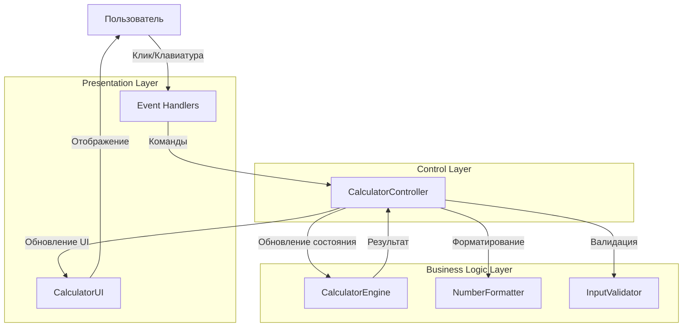
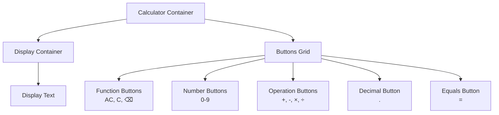
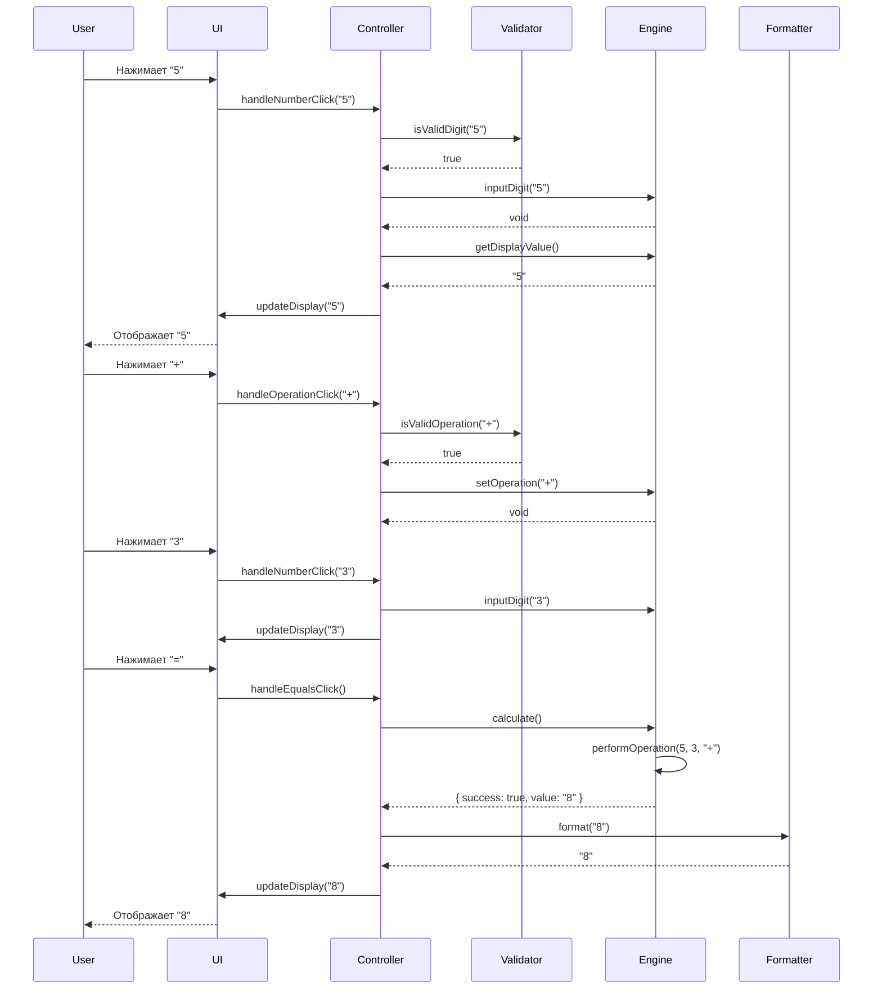
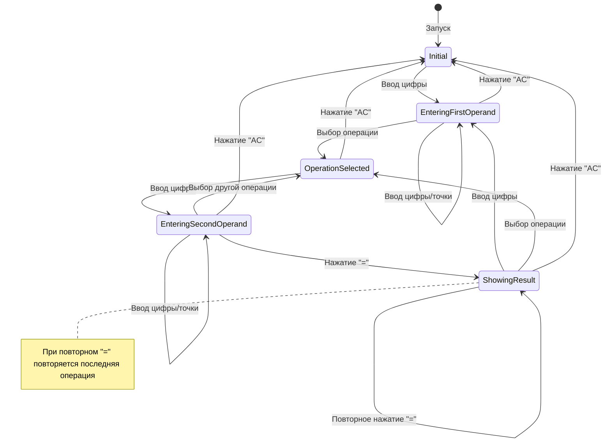
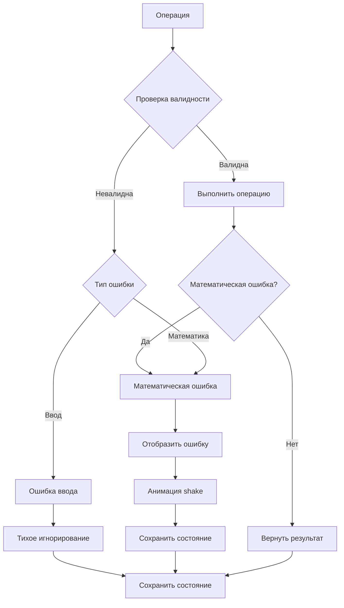

# Документ дизайна: Личный калькулятор

## Обзор

Личный калькулятор — это веб-приложение, реализующее стандартный калькулятор с современным пользовательским интерфейсом. Приложение построено на принципах разделения ответственности: вычислительная логика отделена от логики представления, что обеспечивает тестируемость и поддерживаемость кода.

### Ключевые характеристики

- Поддержка четырех базовых арифметических операций (+, -, ×, ÷)
- Работа с десятичными числами с точностью до 10 знаков после запятой
- Последовательные вычисления с использованием результата предыдущей операции
- Современный адаптивный интерфейс с анимациями
- Поддержка ввода с клавиатуры и мыши
- Обработка граничных случаев (деление на ноль, переполнение)

### Технологический стек

- HTML5 для структуры
- CSS3 для стилизации и анимаций
- Vanilla JavaScript (ES6+) для логики
- Без внешних зависимостей для минимизации размера и времени загрузки

## Архитектура

### Архитектурный паттерн

Приложение следует паттерну MVC (Model-View-Controller):

- **Model (Модель)**: `CalculatorEngine` — содержит состояние калькулятора и вычислительную логику
- **View (Представление)**: `CalculatorUI` — управляет отображением и обновлением DOM
- **Controller (Контроллер)**: `CalculatorController` — обрабатывает пользовательский ввод и координирует взаимодействие между моделью и представлением


### Диаграмма архитектуры



### Поток данных

1. Пользователь взаимодействует с интерфейсом (клик по кнопке или нажатие клавиши)
2. Обработчик событий перехватывает действие и передает команду контроллеру
3. Контроллер валидирует ввод через `InputValidator`
4. Контроллер обновляет состояние через `CalculatorEngine`
5. Движок выполняет вычисления и возвращает результат
6. Контроллер форматирует результат через `NumberFormatter`
7. Контроллер обновляет UI через `CalculatorUI`
8. Пользователь видит обновленное отображение

## Компоненты и интерфейсы

### 1. CalculatorEngine (Вычислительный движок)

Отвечает за хранение состояния калькулятора и выполнение арифметических операций.

#### Состояние

```javascript
{
  currentValue: string,        // Текущее отображаемое значение
  previousValue: string | null, // Предыдущий операнд
  operation: string | null,     // Текущая операция: '+', '-', '*', '/'
  waitingForOperand: boolean,   // Флаг ожидания нового операнда
  lastOperation: {              // Для повторения операции при нажатии '='
    operator: string | null,
    operand: string | null
  }
}
```

#### Интерфейс

```javascript
class CalculatorEngine {
  constructor()
  
  // Ввод цифры
  inputDigit(digit: string): void
  
  // Ввод десятичной точки
  inputDecimal(): void
  
  // Выбор операции
  setOperation(operator: string): void
  
  // Выполнение вычисления
  calculate(): { success: boolean, value: string, error?: string }
  
  // Очистка текущего ввода
  clear(): void
  
  // Полная очистка
  clearAll(): void
  
  // Удаление последнего символа
  backspace(): void
  
  // Получение текущего значения для отображения
  getDisplayValue(): string
  
  // Получение текущего состояния
  getState(): object
}
```

#### Вычислительные функции

```javascript
// Выполнение арифметической операции
function performOperation(a: number, b: number, operator: string): number

// Проверка деления на ноль
function isDivisionByZero(divisor: number): boolean

// Округление результата до 10 знаков
function roundToPrecision(value: number, precision: number): number
```

### 2. CalculatorUI (Пользовательский интерфейс)

Отвечает за отображение и обновление DOM-элементов.

#### Интерфейс

```javascript
class CalculatorUI {
  constructor(displayElement: HTMLElement)
  
  // Обновление дисплея
  updateDisplay(value: string): void
  
  // Отображение ошибки
  showError(message: string): void
  
  // Анимация нажатия кнопки
  animateButton(button: HTMLElement): void
  
  // Получение всех кнопок
  getButtons(): { 
    numbers: HTMLElement[], 
    operations: HTMLElement[], 
    equals: HTMLElement,
    clear: HTMLElement,
    clearAll: HTMLElement,
    decimal: HTMLElement,
    backspace: HTMLElement
  }
}
```

### 3. CalculatorController (Контроллер)

Координирует взаимодействие между движком и UI, обрабатывает пользовательский ввод.

#### Интерфейс

```javascript
class CalculatorController {
  constructor(engine: CalculatorEngine, ui: CalculatorUI)
  
  // Инициализация обработчиков событий
  initialize(): void
  
  // Обработка нажатия кнопки с цифрой
  handleNumberClick(digit: string): void
  
  // Обработка нажатия кнопки операции
  handleOperationClick(operator: string): void
  
  // Обработка нажатия кнопки "="
  handleEqualsClick(): void
  
  // Обработка нажатия кнопки "C"
  handleClearClick(): void
  
  // Обработка нажатия кнопки "AC"
  handleClearAllClick(): void
  
  // Обработка нажатия кнопки десятичной точки
  handleDecimalClick(): void
  
  // Обработка нажатия кнопки удаления
  handleBackspaceClick(): void
  
  // Обработка клавиатурного ввода
  handleKeyboardInput(event: KeyboardEvent): void
  
  // Обновление отображения
  updateDisplay(): void
}
```

### 4. NumberFormatter (Форматировщик чисел)

Утилита для форматирования чисел для отображения.

#### Интерфейс

```javascript
class NumberFormatter {
  // Форматирование числа для отображения
  static format(value: string, maxLength: number = 15): string
  
  // Преобразование в научную нотацию при необходимости
  static toScientificNotation(value: number): string
  
  // Проверка необходимости научной нотации
  static needsScientificNotation(value: string, maxLength: number): boolean
  
  // Форматирование с ограничением десятичных знаков
  static formatDecimal(value: number, maxDecimals: number = 10): string
}
```

### 5. InputValidator (Валидатор ввода)

Утилита для валидации пользовательского ввода.

#### Интерфейс

```javascript
class InputValidator {
  // Проверка валидности цифры
  static isValidDigit(input: string): boolean
  
  // Проверка валидности операции
  static isValidOperation(input: string): boolean
  
  // Проверка максимальной длины ввода
  static isWithinMaxLength(value: string, maxLength: number = 15): boolean
  
  // Проверка наличия десятичной точки
  static hasDecimalPoint(value: string): boolean
  
  // Валидация клавиатурного ввода
  static isValidKeyboardInput(key: string): boolean
}
```

## Модели данных

### CalculatorState (Состояние калькулятора)

```javascript
interface CalculatorState {
  currentValue: string;        // Текущее значение на дисплее (строка для сохранения точности)
  previousValue: string | null; // Предыдущий операнд
  operation: string | null;     // Текущая операция: '+', '-', '*', '/' или null
  waitingForOperand: boolean;   // true, если ожидается ввод нового операнда
  lastOperation: {
    operator: string | null;    // Последняя выполненная операция
    operand: string | null;     // Последний операнд для повторения
  };
}
```

Начальное состояние:
```javascript
{
  currentValue: '0',
  previousValue: null,
  operation: null,
  waitingForOperand: false,
  lastOperation: {
    operator: null,
    operand: null
  }
}
```

### CalculationResult (Результат вычисления)

```javascript
interface CalculationResult {
  success: boolean;      // true, если вычисление успешно
  value: string;         // Результат вычисления или текущее значение
  error?: string;        // Сообщение об ошибке (если success = false)
}
```

Примеры:
```javascript
// Успешное вычисление
{ success: true, value: '42.5' }

// Деление на ноль
{ success: false, value: '0', error: 'Ошибка: деление на ноль' }
```

### ButtonConfig (Конфигурация кнопок)

```javascript
interface ButtonConfig {
  type: 'number' | 'operation' | 'function' | 'equals';
  value: string;
  display: string;
  cssClass: string;
  keyboardKey?: string;
}
```

Примеры конфигураций:
```javascript
// Кнопка с цифрой
{ type: 'number', value: '7', display: '7', cssClass: 'btn-number', keyboardKey: '7' }

// Кнопка операции
{ type: 'operation', value: '+', display: '+', cssClass: 'btn-operation', keyboardKey: '+' }

// Функциональная кнопка
{ type: 'function', value: 'clear', display: 'C', cssClass: 'btn-function', keyboardKey: 'c' }

// Кнопка равно
{ type: 'equals', value: '=', display: '=', cssClass: 'btn-equals', keyboardKey: 'Enter' }
```

## Визуальный дизайн интерфейса

### Структура HTML

```
calculator-container
├── display-container
│   └── display (текстовое поле)
└── buttons-grid
    ├── btn-function (AC)
    ├── btn-function (C)
    ├── btn-function (⌫)
    ├── btn-operation (÷)
    ├── btn-number (7, 8, 9)
    ├── btn-operation (×)
    ├── btn-number (4, 5, 6)
    ├── btn-operation (-)
    ├── btn-number (1, 2, 3)
    ├── btn-operation (+)
    ├── btn-number (0)
    ├── btn-decimal (.)
    └── btn-equals (=)
```

### Раскладка кнопок (Grid Layout)

```
┌─────────────────────────────┐
│         Display             │
├───────┬───────┬───────┬─────┤
│  AC   │   C   │   ⌫   │  ÷  │
├───────┼───────┼───────┼─────┤
│   7   │   8   │   9   │  ×  │
├───────┼───────┼───────┼─────┤
│   4   │   5   │   6   │  -  │
├───────┼───────┼───────┼─────┤
│   1   │   2   │   3   │  +  │
├───────┴───────┼───────┼─────┤
│       0       │   .   │  =  │
└───────────────┴───────┴─────┘
```

### Цветовая схема

```css
/* Основные цвета */
--primary-bg: #1e1e1e;           /* Фон калькулятора */
--display-bg: #2d2d2d;           /* Фон дисплея */
--display-text: #ffffff;         /* Текст дисплея */

/* Кнопки */
--btn-number-bg: #505050;        /* Фон кнопок с цифрами */
--btn-number-hover: #606060;     /* Hover состояние цифр */
--btn-operation-bg: #ff9500;     /* Фон кнопок операций */
--btn-operation-hover: #ffb143;  /* Hover состояние операций */
--btn-function-bg: #a5a5a5;      /* Фон функциональных кнопок */
--btn-function-hover: #b5b5b5;   /* Hover состояние функций */
--btn-equals-bg: #ff9500;        /* Фон кнопки равно */
--btn-equals-hover: #ffb143;     /* Hover состояние равно */

/* Текст кнопок */
--btn-text: #ffffff;             /* Цвет текста на кнопках */

/* Тени и эффекты */
--shadow-main: 0 8px 16px rgba(0, 0, 0, 0.3);
--shadow-button: 0 2px 4px rgba(0, 0, 0, 0.2);
```

### Размеры и отступы

```css
/* Контейнер калькулятора */
.calculator-container {
  width: 360px;
  max-width: 100%;
  padding: 20px;
  border-radius: 16px;
  box-shadow: var(--shadow-main);
}

/* Дисплей */
.display-container {
  height: 100px;
  padding: 20px;
  border-radius: 12px;
  margin-bottom: 20px;
  font-size: 48px;
  text-align: right;
}

/* Сетка кнопок */
.buttons-grid {
  display: grid;
  grid-template-columns: repeat(4, 1fr);
  gap: 12px;
}

/* Кнопки */
.btn {
  height: 70px;
  border-radius: 12px;
  font-size: 24px;
  border: none;
  cursor: pointer;
  transition: all 0.15s ease;
  box-shadow: var(--shadow-button);
}

/* Кнопка 0 занимает 2 колонки */
.btn-zero {
  grid-column: span 2;
}
```

### Адаптивность

```css
/* Планшеты (768px - 1024px) */
@media (max-width: 1024px) {
  .calculator-container {
    width: 340px;
  }
  
  .display-container {
    font-size: 42px;
  }
  
  .btn {
    height: 65px;
    font-size: 22px;
  }
}

/* Мобильные устройства (320px - 767px) */
@media (max-width: 767px) {
  .calculator-container {
    width: 100%;
    max-width: 340px;
    padding: 16px;
  }
  
  .display-container {
    height: 80px;
    font-size: 36px;
    padding: 16px;
  }
  
  .buttons-grid {
    gap: 10px;
  }
  
  .btn {
    height: 60px;
    font-size: 20px;
  }
}

/* Очень маленькие экраны (320px) */
@media (max-width: 360px) {
  .display-container {
    font-size: 32px;
  }
  
  .btn {
    height: 55px;
    font-size: 18px;
  }
}
```

### Анимации

```css
/* Анимация нажатия кнопки */
@keyframes button-press {
  0% {
    transform: scale(1);
  }
  50% {
    transform: scale(0.95);
  }
  100% {
    transform: scale(1);
  }
}

.btn-pressed {
  animation: button-press 0.15s ease;
}

/* Hover эффект */
.btn:hover {
  transform: translateY(-2px);
  box-shadow: 0 4px 8px rgba(0, 0, 0, 0.3);
}

.btn:active {
  transform: translateY(0);
  box-shadow: var(--shadow-button);
}

/* Анимация появления ошибки */
@keyframes shake {
  0%, 100% { transform: translateX(0); }
  25% { transform: translateX(-10px); }
  75% { transform: translateX(10px); }
}

.display-error {
  animation: shake 0.3s ease;
  color: #ff4444;
}
```

### Диаграмма компонентов UI



## Алгоритмы и детальная логика

### Алгоритм обработки ввода цифры

```
function inputDigit(digit):
  if waitingForOperand:
    currentValue = digit
    waitingForOperand = false
  else:
    if currentValue == '0':
      currentValue = digit
    else if length(currentValue) < MAX_LENGTH:
      currentValue = currentValue + digit
  
  updateDisplay()
```

### Алгоритм обработки десятичной точки

```
function inputDecimal():
  if waitingForOperand:
    currentValue = '0.'
    waitingForOperand = false
  else if not hasDecimalPoint(currentValue):
    currentValue = currentValue + '.'
  
  updateDisplay()
```

### Алгоритм выбора операции

```
function setOperation(operator):
  if previousValue == null:
    previousValue = currentValue
    operation = operator
    waitingForOperand = true
  else if operation != null and not waitingForOperand:
    // Выполнить предыдущую операцию перед установкой новой
    result = calculate()
    if result.success:
      currentValue = result.value
      previousValue = result.value
      operation = operator
      waitingForOperand = true
    else:
      showError(result.error)
  else:
    // Просто меняем операцию
    operation = operator
    waitingForOperand = true
  
  updateDisplay()
```

### Алгоритм вычисления

```
function calculate():
  if previousValue == null or operation == null:
    return { success: true, value: currentValue }
  
  operand1 = parseFloat(previousValue)
  operand2 = parseFloat(currentValue)
  
  // Сохранить для повторения операции
  lastOperation.operator = operation
  lastOperation.operand = currentValue
  
  result = performOperation(operand1, operand2, operation)
  
  if result.error:
    return { success: false, value: currentValue, error: result.error }
  
  // Округлить до 10 знаков после запятой
  roundedResult = roundToPrecision(result.value, 10)
  formattedResult = formatNumber(roundedResult)
  
  // Сбросить состояние
  previousValue = null
  operation = null
  waitingForOperand = true
  
  return { success: true, value: formattedResult }
```

### Алгоритм повторения операции (при повторном нажатии "=")

```
function repeatLastOperation():
  if lastOperation.operator == null or lastOperation.operand == null:
    return { success: true, value: currentValue }
  
  operand1 = parseFloat(currentValue)
  operand2 = parseFloat(lastOperation.operand)
  
  result = performOperation(operand1, operand2, lastOperation.operator)
  
  if result.error:
    return { success: false, value: currentValue, error: result.error }
  
  roundedResult = roundToPrecision(result.value, 10)
  formattedResult = formatNumber(roundedResult)
  
  return { success: true, value: formattedResult }
```

### Алгоритм выполнения арифметической операции

```
function performOperation(a, b, operator):
  switch operator:
    case '+':
      return { value: a + b }
    case '-':
      return { value: a - b }
    case '*':
      return { value: a * b }
    case '/':
      if b == 0:
        return { error: 'Ошибка: деление на ноль' }
      return { value: a / b }
    default:
      return { error: 'Неизвестная операция' }
```

### Алгоритм форматирования числа для отображения

```
function formatNumber(value):
  valueStr = toString(value)
  
  // Проверка на необходимость научной нотации
  if length(valueStr) > MAX_DISPLAY_LENGTH:
    return toScientificNotation(value)
  
  // Удаление незначащих нулей после запятой
  if contains(valueStr, '.'):
    valueStr = removeTrailingZeros(valueStr)
  
  return valueStr

function toScientificNotation(value):
  return value.toExponential(6)  // 6 значащих цифр

function removeTrailingZeros(valueStr):
  while endsWith(valueStr, '0') and contains(valueStr, '.'):
    valueStr = removeLastChar(valueStr)
  
  if endsWith(valueStr, '.'):
    valueStr = removeLastChar(valueStr)
  
  return valueStr
```

### Алгоритм обработки клавиатурного ввода

```
function handleKeyboardInput(event):
  key = event.key
  
  // Цифры
  if key matches /[0-9]/:
    handleNumberClick(key)
    return
  
  // Операции
  if key in ['+', '-', '*', '/']:
    operator = mapKeyToOperator(key)  // '*' -> '×', '/' -> '÷'
    handleOperationClick(operator)
    return
  
  // Десятичная точка
  if key in ['.', ',']:
    handleDecimalClick()
    return
  
  // Равно
  if key in ['Enter', '=']:
    event.preventDefault()
    handleEqualsClick()
    return
  
  // Очистка
  if key in ['Escape', 'c', 'C']:
    handleClearClick()
    return
  
  // Backspace
  if key == 'Backspace':
    event.preventDefault()
    handleBackspaceClick()
    return
```

### Диаграмма последовательности: Выполнение вычисления



### Диаграмма состояний калькулятора



## Свойства корректности

Свойство — это характеристика или поведение, которое должно оставаться истинным во всех допустимых выполнениях системы. По сути, это формальное утверждение о том, что система должна делать. Свойства служат мостом между человекочитаемыми спецификациями и машинно-проверяемыми гарантиями корректности.

### Рефлексия свойств

После анализа всех критериев приемки выявлены следующие группы свойств:

**Арифметические операции (1.1-1.4)**: Можно объединить в одно свойство, проверяющее корректность всех четырех операций.

**Ввод цифр и отображение (2.1, 3.1)**: Эти свойства пересекаются - оба проверяют, что введенные цифры корректно отображаются. Объединяем в одно свойство.

**Точность вычислений (3.4, 10.1, 10.2)**: Требования 3.4 и 10.1 идентичны, 10.2 является конкретизацией. Объединяем в одно свойство с проверкой округления.

**Клавиатурный ввод (8.1-8.5)**: Все эти свойства проверяют эквивалентность клавиатурного и кнопочного ввода. Можно объединить в одно комплексное свойство.

**Результат как операнд (3.2, 5.1)**: Требование 3.2 является частью 5.1. Оставляем только 5.1.

Остальные свойства предоставляют уникальную ценность для валидации и остаются отдельными.

### Свойство 1: Корректность арифметических операций

*Для любых* двух чисел a и b и любой арифметической операции op ∈ {+, -, ×, ÷} (где b ≠ 0 для деления), результат вычисления должен быть математически корректным с точностью до погрешности округления (≤ 0.0000000001).

**Валидирует: Требования 1.1, 1.2, 1.3, 1.4**

### Свойство 2: Обработка деления на ноль

*Для любого* числа a, попытка выполнить операцию a ÷ 0 должна возвращать ошибку с сообщением "Ошибка: деление на ноль", и состояние калькулятора должно оставаться неизменным.

**Валидирует: Требование 1.5**

### Свойство 3: Ввод и отображение цифр

*Для любой* последовательности цифр длиной до 15 символов, последовательный ввод этих цифр должен привести к отображению на дисплее строки, содержащей эти цифры в том же порядке.

**Валидирует: Требования 2.1, 2.4, 3.1**

### Свойство 4: Добавление десятичной точки

*Для любого* текущего значения без десятичной точки, нажатие кнопки десятичной точки должно добавить точку к текущему значению.

**Валидирует: Требование 2.2**

### Свойство 5: Игнорирование повторной десятичной точки

*Для любого* текущего значения, уже содержащего десятичную точку, повторное нажатие кнопки десятичной точки не должно изменять отображаемое значение.

**Валидирует: Требование 2.3**

### Свойство 6: Ограничение длины ввода

*Для любой* последовательности цифр длиной более 15 символов, калькулятор должен принять только первые 15 цифр, а остальные игнорировать.

**Валидирует: Требование 2.4**

### Свойство 7: Научная нотация для длинных чисел

*Для любого* числа, строковое представление которого превышает 15 символов, дисплей должен отображать это число в научной нотации (экспоненциальной форме).

**Валидирует: Требование 3.3**

### Свойство 8: Точность округления

*Для любого* результата вычисления, содержащего более 10 знаков после запятой (включая периодические дроби), результат должен быть округлен до 10 знаков после запятой.

**Валидирует: Требования 3.4, 10.1, 10.2**

### Свойство 9: Очистка текущего ввода (C)

*Для любого* состояния калькулятора с непустым текущим вводом, нажатие кнопки "C" должно установить текущий ввод в "0", сохраняя при этом предыдущий операнд и выбранную операцию.

**Валидирует: Требование 4.1**

### Свойство 10: Полная очистка (AC)

*Для любого* состояния калькулятора, нажатие кнопки "AC" должно сбросить все состояние к начальному: currentValue = "0", previousValue = null, operation = null, waitingForOperand = false.

**Валидирует: Требование 4.2**

### Свойство 11: Удаление последнего символа (Backspace)

*Для любой* строки ввода длиной n > 1, нажатие кнопки удаления должно удалить последний символ, оставив строку длиной n-1. Если длина равна 1, результат должен быть "0".

**Валидирует: Требование 4.3**

### Свойство 12: Цепочка вычислений

*Для любого* результата вычисления R и любой операции op, нажатие кнопки операции после получения результата должно использовать R как первый операнд для следующей операции.

**Валидирует: Требование 5.1**

### Свойство 13: Автоматическое вычисление при смене операции

*Для любого* состояния калькулятора с установленными previousValue, operation и currentValue, выбор новой операции должен сначала выполнить текущую операцию, затем использовать её результат как previousValue для новой операции.

**Валидирует: Требование 5.2**

### Свойство 14: Повторение последней операции

*Для любой* выполненной операции (operand1 op operand2 = result), повторное нажатие кнопки "=" должно применить ту же операцию op к текущему результату с тем же operand2: result op operand2.

**Валидирует: Требование 5.3**

### Свойство 15: Эквивалентность клавиатурного и кнопочного ввода

*Для любой* последовательности действий, выполнение этих действий через клавиатуру (цифры 0-9, операции +, -, *, /, Enter для "=", Escape для "C", Backspace для удаления) должно давать тот же результат, что и выполнение через нажатие соответствующих кнопок интерфейса.

**Валидирует: Требования 8.1, 8.2, 8.3, 8.4, 8.5**

### Свойство 16: Математическая эквивалентность последовательностей операций

*Для любых* двух математически эквивалентных последовательностей операций (например, (a + b) + c и a + (b + c) для сложения), результаты должны совпадать с погрешностью не более 0.0000000001.

**Валидирует: Требование 10.3**

### Свойство 17: Идемпотентность очистки

*Для любого* состояния калькулятора, двойное нажатие "AC" должно давать тот же результат, что и одинарное нажатие "AC" (начальное состояние).

**Валидирует: Общая корректность операции очистки**

### Свойство 18: Инвариант состояния после ошибки

*Для любой* операции, приводящей к ошибке (например, деление на ноль), состояние калькулятора до ошибки должно быть сохранено, и пользователь должен иметь возможность продолжить работу после очистки ошибки.

**Валидирует: Общая устойчивость к ошибкам**

## Обработка ошибок

### Типы ошибок

#### 1. Математические ошибки

**Деление на ноль**
- Условие: Пользователь пытается выполнить операцию деления, где делитель равен 0
- Обработка: 
  - Вернуть объект ошибки: `{ success: false, value: currentValue, error: 'Ошибка: деление на ноль' }`
  - Отобразить сообщение об ошибке на дисплее красным цветом
  - Применить анимацию "shake" к дисплею
  - Сохранить предыдущее состояние калькулятора
- Восстановление: Пользователь может нажать "C" или "AC" для продолжения работы

**Переполнение (Overflow)**
- Условие: Результат вычисления превышает максимальное представимое число (> Number.MAX_VALUE)
- Обработка:
  - Вернуть объект ошибки: `{ success: false, value: currentValue, error: 'Ошибка: переполнение' }`
  - Отобразить "Infinity" или сообщение об ошибке
- Восстановление: Нажатие "AC" для сброса

**Потеря значимости (Underflow)**
- Условие: Результат вычисления меньше минимального представимого числа (< Number.MIN_VALUE)
- Обработка:
  - Округлить до 0 или отобразить в научной нотации
  - Продолжить работу с округленным значением

#### 2. Ошибки ввода

**Превышение максимальной длины**
- Условие: Пользователь пытается ввести более 15 цифр
- Обработка:
  - Игнорировать дополнительные цифры
  - Не отображать визуальную ошибку (тихое игнорирование)
  - Опционально: легкая визуальная индикация (например, кратковременное изменение цвета границы дисплея)

**Повторная десятичная точка**
- Условие: Пользователь пытается ввести вторую десятичную точку
- Обработка:
  - Игнорировать ввод
  - Не изменять текущее значение

**Некорректный клавиатурный ввод**
- Условие: Пользователь нажимает неподдерживаемую клавишу
- Обработка:
  - Игнорировать ввод
  - Не выполнять никаких действий

### Стратегия обработки ошибок

```javascript
class ErrorHandler {
  // Обработка математических ошибок
  static handleMathError(error: string): void {
    displayError(error);
    animateError();
    logError('MathError', error);
  }
  
  // Обработка ошибок ввода (тихое игнорирование)
  static handleInputError(error: string): void {
    // Не отображаем ошибку пользователю
    logError('InputError', error);
  }
  
  // Логирование ошибок (для отладки)
  static logError(type: string, message: string): void {
    if (isDevelopment()) {
      console.warn(`[${type}] ${message}`);
    }
  }
}
```

### Диаграмма обработки ошибок



## Стратегия тестирования

### Подход к тестированию

Для обеспечения корректности калькулятора используется двойной подход к тестированию:

1. **Unit-тесты**: Проверяют конкретные примеры, граничные случаи и условия ошибок
2. **Property-based тесты**: Проверяют универсальные свойства на множестве случайно сгенерированных входных данных

Оба типа тестов дополняют друг друга: unit-тесты выявляют конкретные баги, а property-based тесты проверяют общую корректность.

### Библиотека для property-based тестирования

**Выбранная библиотека**: `fast-check` (для JavaScript/TypeScript)

**Обоснование выбора**:
- Зрелая и активно поддерживаемая библиотека
- Богатый набор встроенных генераторов
- Поддержка пользовательских генераторов
- Хорошая интеграция с популярными test runners (Jest, Mocha, Vitest)
- Отличная документация и примеры

**Установка**:
```bash
npm install --save-dev fast-check
```

### Конфигурация property-based тестов

Каждый property-based тест должен:
- Выполняться минимум **100 итераций** (конфигурация `numRuns: 100`)
- Содержать комментарий-тег, ссылающийся на свойство из документа дизайна
- Использовать подходящие генераторы для создания тестовых данных

**Формат тега**:
```javascript
// Feature: personal-calculator, Property {номер}: {текст свойства}
```

**Пример конфигурации**:
```javascript
import fc from 'fast-check';

// Feature: personal-calculator, Property 1: Корректность арифметических операций
test('arithmetic operations are mathematically correct', () => {
  fc.assert(
    fc.property(
      fc.double({ min: -1e10, max: 1e10, noNaN: true }),
      fc.double({ min: -1e10, max: 1e10, noNaN: true }),
      fc.constantFrom('+', '-', '*', '/'),
      (a, b, op) => {
        // Пропускаем деление на ноль
        if (op === '/' && Math.abs(b) < 1e-10) return true;
        
        const engine = new CalculatorEngine();
        // ... тестовая логика
      }
    ),
    { numRuns: 100 }
  );
});
```

### Генераторы данных

#### Генератор чисел для калькулятора
```javascript
const calculatorNumber = fc.double({
  min: -999999999999999,
  max: 999999999999999,
  noNaN: true,
  noDefaultInfinity: true
});
```

#### Генератор строк ввода
```javascript
const inputString = fc.stringOf(
  fc.constantFrom('0', '1', '2', '3', '4', '5', '6', '7', '8', '9', '.'),
  { minLength: 1, maxLength: 15 }
);
```

#### Генератор операций
```javascript
const operation = fc.constantFrom('+', '-', '*', '/');
```

#### Генератор последовательности действий
```javascript
const actionSequence = fc.array(
  fc.oneof(
    fc.record({ type: fc.constant('digit'), value: fc.integer({ min: 0, max: 9 }) }),
    fc.record({ type: fc.constant('operation'), value: operation }),
    fc.record({ type: fc.constant('decimal') }),
    fc.record({ type: fc.constant('equals') }),
    fc.record({ type: fc.constant('clear') })
  ),
  { minLength: 1, maxLength: 20 }
);
```

### Структура тестов

```
tests/
├── unit/
│   ├── CalculatorEngine.test.js
│   ├── NumberFormatter.test.js
│   ├── InputValidator.test.js
│   └── CalculatorUI.test.js
├── property/
│   ├── arithmetic.property.test.js
│   ├── input.property.test.js
│   ├── state.property.test.js
│   └── keyboard.property.test.js
├── integration/
│   └── CalculatorController.test.js
└── e2e/
    └── calculator.e2e.test.js
```

### Примеры тестов

#### Unit-тест: Конкретный пример
```javascript
describe('CalculatorEngine - Addition', () => {
  test('should add 2 + 3 to get 5', () => {
    const engine = new CalculatorEngine();
    engine.inputDigit('2');
    engine.setOperation('+');
    engine.inputDigit('3');
    const result = engine.calculate();
    
    expect(result.success).toBe(true);
    expect(result.value).toBe('5');
  });
  
  test('should handle division by zero', () => {
    const engine = new CalculatorEngine();
    engine.inputDigit('5');
    engine.setOperation('/');
    engine.inputDigit('0');
    const result = engine.calculate();
    
    expect(result.success).toBe(false);
    expect(result.error).toBe('Ошибка: деление на ноль');
  });
});
```

#### Property-based тест: Универсальное свойство
```javascript
import fc from 'fast-check';

describe('CalculatorEngine - Properties', () => {
  // Feature: personal-calculator, Property 1: Корректность арифметических операций
  test('all arithmetic operations are mathematically correct', () => {
    fc.assert(
      fc.property(
        fc.double({ min: -1e10, max: 1e10, noNaN: true }),
        fc.double({ min: -1e10, max: 1e10, noNaN: true }),
        fc.constantFrom('+', '-', '*', '/'),
        (a, b, op) => {
          // Пропускаем деление на ноль
          if (op === '/' && Math.abs(b) < 1e-10) return true;
          
          const engine = new CalculatorEngine();
          engine.currentValue = a.toString();
          engine.setOperation(op);
          engine.currentValue = b.toString();
          const result = engine.calculate();
          
          expect(result.success).toBe(true);
          
          const expected = performMathOperation(a, b, op);
          const actual = parseFloat(result.value);
          const tolerance = 1e-10;
          
          expect(Math.abs(actual - expected)).toBeLessThanOrEqual(tolerance);
        }
      ),
      { numRuns: 100 }
    );
  });
  
  // Feature: personal-calculator, Property 3: Ввод и отображение цифр
  test('input sequence is correctly displayed', () => {
    fc.assert(
      fc.property(
        fc.array(fc.integer({ min: 0, max: 9 }), { minLength: 1, maxLength: 15 }),
        (digits) => {
          const engine = new CalculatorEngine();
          
          digits.forEach(digit => {
            engine.inputDigit(digit.toString());
          });
          
          const expected = digits.join('');
          const actual = engine.getDisplayValue();
          
          expect(actual).toBe(expected);
        }
      ),
      { numRuns: 100 }
    );
  });
  
  // Feature: personal-calculator, Property 10: Полная очистка (AC)
  test('AC resets calculator to initial state from any state', () => {
    fc.assert(
      fc.property(
        fc.array(
          fc.oneof(
            fc.record({ type: fc.constant('digit'), value: fc.integer({ min: 0, max: 9 }) }),
            fc.record({ type: fc.constant('operation'), value: fc.constantFrom('+', '-', '*', '/') })
          ),
          { minLength: 1, maxLength: 10 }
        ),
        (actions) => {
          const engine = new CalculatorEngine();
          
          // Выполняем случайные действия
          actions.forEach(action => {
            if (action.type === 'digit') {
              engine.inputDigit(action.value.toString());
            } else {
              engine.setOperation(action.value);
            }
          });
          
          // Нажимаем AC
          engine.clearAll();
          
          // Проверяем начальное состояние
          const state = engine.getState();
          expect(state.currentValue).toBe('0');
          expect(state.previousValue).toBe(null);
          expect(state.operation).toBe(null);
          expect(state.waitingForOperand).toBe(false);
        }
      ),
      { numRuns: 100 }
    );
  });
});
```

### Покрытие тестами

#### Unit-тесты должны покрывать:

**CalculatorEngine**:
- Конкретные примеры каждой операции (2+2=4, 10-5=5, 3×4=12, 8÷2=4)
- Граничные случаи (деление на ноль, очень большие числа, очень маленькие числа)
- Операции с десятичными числами (0.1+0.2, 1/3)
- Последовательные операции (2+3+4, 10-5+3)
- Повторение операции при нажатии "="
- Очистка (C и AC)
- Удаление символов (backspace)

**NumberFormatter**:
- Форматирование целых чисел
- Форматирование десятичных чисел
- Удаление незначащих нулей (1.50 → 1.5)
- Научная нотация для больших чисел
- Округление до 10 знаков после запятой

**InputValidator**:
- Валидация цифр (0-9)
- Валидация операций (+, -, ×, ÷)
- Проверка максимальной длины
- Проверка наличия десятичной точки
- Валидация клавиатурного ввода

**CalculatorUI**:
- Обновление дисплея
- Отображение ошибок
- Анимация нажатия кнопок
- Получение элементов кнопок

#### Property-based тесты должны покрывать:

1. **Свойство 1**: Корректность всех арифметических операций для случайных чисел
2. **Свойство 2**: Деление на ноль всегда возвращает ошибку
3. **Свойство 3**: Последовательность цифр корректно отображается
4. **Свойство 4**: Добавление десятичной точки к числу без точки
5. **Свойство 5**: Игнорирование повторной десятичной точки
6. **Свойство 6**: Ограничение длины ввода до 15 символов
7. **Свойство 7**: Научная нотация для длинных чисел
8. **Свойство 8**: Округление до 10 знаков после запятой
9. **Свойство 9**: Очистка текущего ввода (C)
10. **Свойство 10**: Полная очистка (AC) из любого состояния
11. **Свойство 11**: Удаление последнего символа
12. **Свойство 12**: Цепочка вычислений
13. **Свойство 13**: Автоматическое вычисление при смене операции
14. **Свойство 14**: Повторение последней операции
15. **Свойство 15**: Эквивалентность клавиатурного и кнопочного ввода
16. **Свойство 16**: Математическая эквивалентность последовательностей
17. **Свойство 17**: Идемпотентность очистки
18. **Свойство 18**: Инвариант состояния после ошибки

### Интеграционные тесты

Интеграционные тесты проверяют взаимодействие между компонентами:

```javascript
describe('Calculator Integration', () => {
  test('complete calculation flow: input -> operation -> input -> equals', () => {
    const engine = new CalculatorEngine();
    const ui = new CalculatorUI(document.getElementById('display'));
    const controller = new CalculatorController(engine, ui);
    
    controller.handleNumberClick('5');
    controller.handleOperationClick('+');
    controller.handleNumberClick('3');
    controller.handleEqualsClick();
    
    expect(ui.displayElement.textContent).toBe('8');
  });
  
  test('keyboard input produces same result as button clicks', () => {
    const engine1 = new CalculatorEngine();
    const engine2 = new CalculatorEngine();
    
    // Через кнопки
    engine1.inputDigit('7');
    engine1.setOperation('*');
    engine1.inputDigit('6');
    const result1 = engine1.calculate();
    
    // Через клавиатуру (симуляция)
    const controller = new CalculatorController(engine2, mockUI);
    controller.handleKeyboardInput({ key: '7' });
    controller.handleKeyboardInput({ key: '*' });
    controller.handleKeyboardInput({ key: '6' });
    controller.handleKeyboardInput({ key: 'Enter', preventDefault: () => {} });
    
    expect(engine2.getDisplayValue()).toBe(result1.value);
  });
});
```

### E2E тесты

End-to-end тесты проверяют полный пользовательский сценарий в браузере:

```javascript
describe('Calculator E2E', () => {
  test('user can perform basic calculation', async () => {
    await page.goto('http://localhost:3000');
    
    await page.click('[data-testid="btn-5"]');
    await page.click('[data-testid="btn-plus"]');
    await page.click('[data-testid="btn-3"]');
    await page.click('[data-testid="btn-equals"]');
    
    const display = await page.textContent('[data-testid="display"]');
    expect(display).toBe('8');
  });
  
  test('calculator is responsive on mobile viewport', async () => {
    await page.setViewportSize({ width: 375, height: 667 });
    await page.goto('http://localhost:3000');
    
    const calculator = await page.$('.calculator-container');
    const box = await calculator.boundingBox();
    
    expect(box.width).toBeLessThanOrEqual(375);
    expect(box.width).toBeGreaterThan(300);
  });
});
```

### Метрики качества

**Целевые показатели**:
- Покрытие кода unit-тестами: ≥ 90%
- Покрытие свойств property-based тестами: 100% (все 18 свойств)
- Все тесты должны проходить перед коммитом
- Время выполнения всех тестов: < 30 секунд

**Инструменты**:
- Test runner: Jest или Vitest
- Coverage: Istanbul (встроен в Jest)
- Property-based testing: fast-check
- E2E testing: Playwright или Cypress

## Заключение

Этот документ дизайна определяет полную архитектуру личного калькулятора, включая компоненты, интерфейсы, алгоритмы, визуальный дизайн и стратегию тестирования. Дизайн следует принципам разделения ответственности, обеспечивая тестируемость и поддерживаемость кода.

Ключевые решения:
- Паттерн MVC для разделения логики и представления
- Хранение чисел в виде строк для сохранения точности
- Поддержка последовательных вычислений и повторения операций
- Комплексная обработка ошибок с сохранением состояния
- Двойной подход к тестированию (unit + property-based)
- Адаптивный дизайн для всех размеров экранов
- Поддержка клавиатурного ввода для повышения удобства

Следующий шаг: создание задач для реализации (tasks.md).
